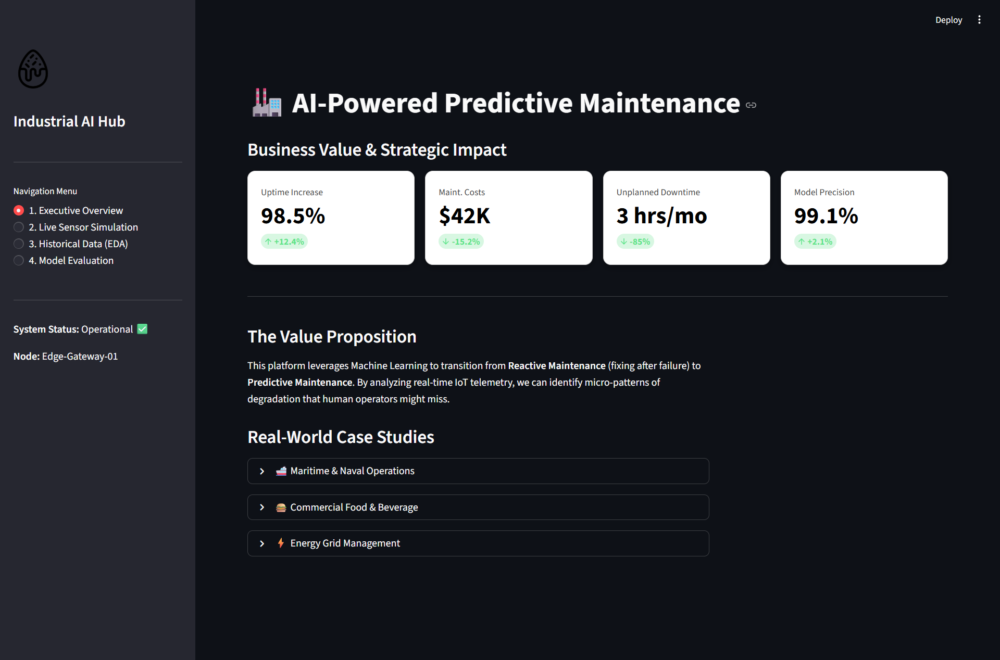
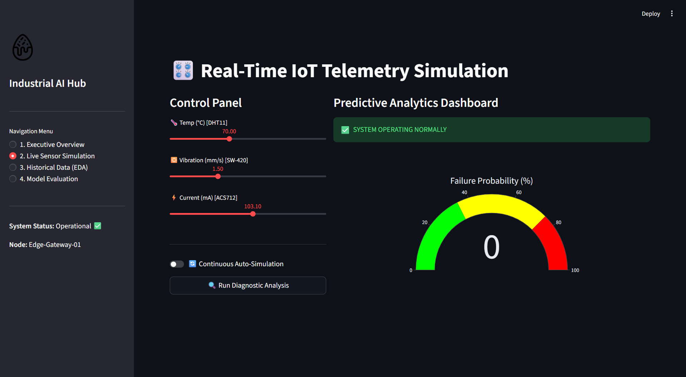

# 🏭 AI-Powered Predictive Maintenance System for Industrial IoT


## 🚀 Project Overview
This project is a comprehensive **Industry 4.0 solution** designed to minimize unplanned downtime in manufacturing environments. By utilizing an ensemble Machine Learning approach, the system monitors multivariate sensor telemetry—**Temperature, Vibration, and Current**—to predict mechanical degradation and execute automated safety protocols before a catastrophic failure occurs.

### 💎 Key Engineering Features
* **Executive Business Dashboard:** Real-time tracking of ROI metrics, Uptime percentages, and Maintenance cost savings.
* **Interactive IoT Simulator:** A virtual hardware interface to manipulate sensor streams (DHT11, SW-420, and ACS712 logic).
* **Automated Kill Switch:** Simulated L298N relay protocol that automatically isolates motor power upon detecting high-risk anomalies.
* **Multivariate Trend Analysis:** Advanced EDA module to visualize correlations between physical stress and machine health.
* **Explainable AI (XAI):** Detailed model transparency through Feature Importance weights and Confusion Matrix analysis.

---

## 📸 System Interface & Walkthrough

### 1. Executive Overview & Strategic Impact
The landing page translates technical AI predictions into business KPIs. It focuses on the **Value Proposition**, showing how the system reduces maintenance overhead and maximizes production uptime.


### 2. Live Sensor Simulation & Diagnostic Engine
This module acts as the "Digital Twin" of the hardware. Users can trigger manual anomalies or enable **Auto-Simulation** to see the AI's real-time reaction and probability scoring.


### 3. Historical Data & Trend Analysis (EDA)
A deep-dive into the sensor data stream. This view highlights "Failure Signatures"—specific moments where vibration and current draw spike simultaneously, indicating a mechanical seize.


### 4. AI Model Performance & Metrics
Transparency is key in industrial AI. This section provides a technical breakdown of the Random Forest model's accuracy, precision, and the specific sensors it relies on for decision-making.


---

## 🛠️ Tech Stack
* **Frontend:** Streamlit (Custom CSS for professional dark-themed UI)
* **Data Science:** Pandas, NumPy, Scikit-Learn
* **Visualization:** Plotly Express, Plotly Graph Objects, Seaborn, Matplotlib
* **Model Logic:** Random Forest Ensemble (100 Decision Trees)

## 📁 Project Architecture
```text
AI-Predictive-Maintenance-IoT/
├── assets/             # Professional UI Screenshots
├── data/               # Simulated IoT sensor logs
├── models/             # Serialized Random Forest (.pkl)
├── src/                # Source Code (App, Simulators, Trainer)
├── requirements.txt    # Project Dependencies
└── README.md           # Technical Documentation